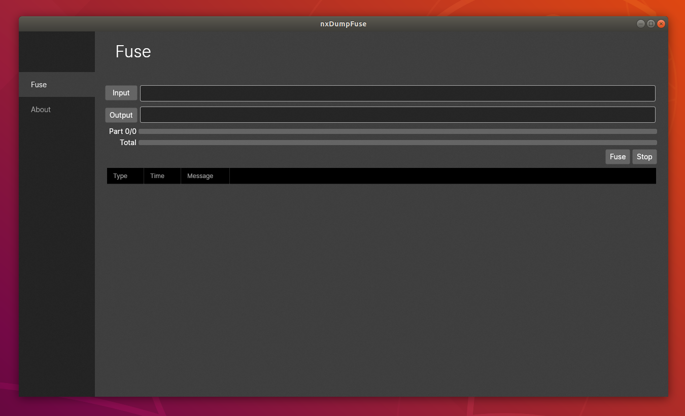
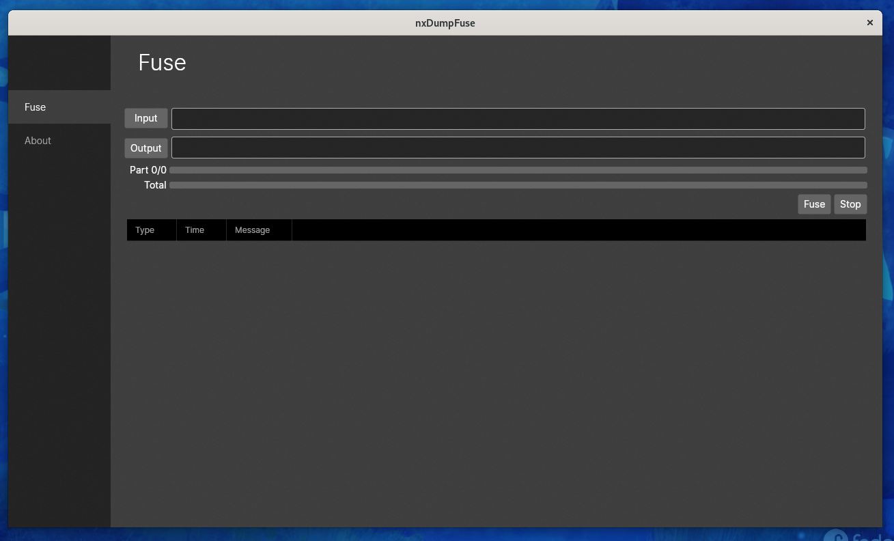

# nxDumpFuse

Cross platform tool used to fuse/merge Nintendo Switch dumps (e.g. dumped using [nxDumpTool](https://github.com/DarkMatterCore/nxdumptool)).

## Tested on

- Windows 10/11
- Linux (Ubuntu/Debian/Fedora)

Will most likely also work on MacOS however I only have an old MBP running 10.10.5 which isn't compatible, if anyone tests successfully let me know.

## Supported filename formats

- `file.ns#`
- `file.nsp.##`
- `file.xc#`
- `file.xci.##`
- `folder/##`

## Usage

~~Instructions on how to use this tool can be found [here](https://yuzu-emu.org/help/quickstart/#merging-split-game-dumps).~~ 

**UPDATE**: As I am sure you have all heard yuzu is shutting down... (RIP Yuzu) Here we are, dropping our hard-earned cash to play games on beast PCs, and then Nintendo goes and squashes the little guys instead of embracing our love for gaming and just giving us what we want. To be fair, I hope they learn from this and provide a gaming experience on par with what we were able to obtain with Yuzu, **on PC!**. Was all about celebrating Nintendo in HD and higher fps, not about piracy. Shame to see such cool projects end like this because of a few bad apples. Let's keep our heads up and find new ways to enjoy our games, legally and with respect. Keep gaming strong, y'all!! Below are the usage instructions copied over from the now removed quick start page.

### Merging Split Game Dumps

**Step 1:** Extract `nxDumpFuse.exe` from the `win-x64.zip` archive.

**Step 2:** Open **nxDumpFuse** and click on `Input`.

**Step 3:** Navigate to ``sdcard:/switch/nxdumptool`` and open the `NSP` or `XCI` folder.

**Step 4:** Select one part of the split game dump, then click on `Open`.
> - For physical dumps, select a `.xc0` file.
> - For digital dumps, select a `00` file that is inside a folder with its respective game name.

**Step 5:** Click on `Output` and navigate to your newly created games folder, then click on `Select Folder`.

**Step 6:** Click on `Fuse`. Wait for the merging process to finish.
> You can see more details on the merging process by expanding the Log frame.

Your merged game dumps should now be available at your games folder.

If you run into issues running on Ubuntu try [this](https://github.com/oMaN-Rod/nxDumpFuse/wiki/Launching).

If you are receiving a libssl error similar to the following you will need to manually install the package, refer to these issues for guidance

```
No usable version of libssl was found
Aborted (core dumped)
```

- [Linux Support](https://github.com/oMaN-Rod/nxDumpFuse/issues/4)
- [No usable version of libssl was found](https://github.com/oMaN-Rod/nxDumpFuse/issues/2)

## Screenshots

### Windows

<p align="center">
    
</p>

### Ubuntu

<p align="center">
    
</p>

### Fedora 34

<p align="center">
    
</p>
